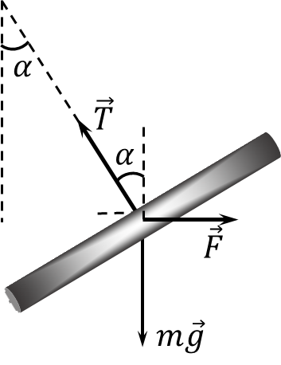

###  Условие

$9.1.5.$ В вертикальном однородном магнитном поле на двух тонких нитях подвешен горизонтально проводник массы $0,16$ кг и длины $80$ см. Концы проводника при помощи гибких проводов, находящихся вне поля, подсоединены к источнику тока. Найдите угол, на который отклоняются от вертикали нити подвеса, если по проводнику течет ток $2$ А, а индукция магнитного поля $1$ Тл.

### Решение

Сила Ампера, действующая на проводник

$$
F = Il\cdot B
$$

Из второго закона Ньютона, условие равновесия на горизонтальную и вертикальные оси

$$
T\cos\alpha = mg;\quad T\sin\alpha = F
$$

разделив одно выражение на другое, получим

$$
\tan\alpha = \frac{F}{mg}
$$

$$
\boxed{\alpha = \arctan \left(\frac{IlB}{mg}\right) = 45^{\circ}}
$$

#### Ответ: $\alpha = 45^{\circ}$