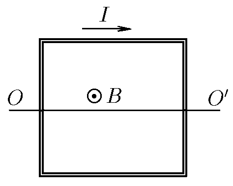

###  Условие 

$9.1.8^*.$ В однородном магнитном поле индукции $B$ находится квадратная рамка с током. Масса рамки $m$, ток в ней $I$. Определите частоту свободных колебаний рамки вокруг оси $OO^\prime$ 

### Решение

Рассмотрим малое отклонение от равновесия на угол $\alpha$: 

Момент действующий на рамку со стороны магнитного поля: $$M = BIS\cdot \sin\alpha = BIa^2 \sin\alpha$$ где $a$ — сторона рамки

сила тяжести не создает момента так как проходит через точку вращения

Из основного уравнения вращательного движения: $$J\ddot{\alpha} = \sum\pm{M_i}$$ для нашего случая: $$J\ddot{\alpha} = -BIa^2 \sin\alpha\tag{1}$$ теперь найдём момент инерции $J$ рамки при наблюдаемых колебаниях

Момент инерции верхней и нижней стороны рамки составляет $$J_1=J_2 = \frac{m}{4}\cdot \left(\frac{a}{2}\right)^2 = \frac{m a^2}{16}\tag{2}$$ где $a/2$ — расстояние до этой стороны.

Момент инерции боковых сторон: $$J_3 = J_4 = \frac{1}{12} \cdot \frac{m}{4}\cdot a^2 = \frac{m a^2}{48}\tag{3}$$ Находим момент инерции $J$, подставляя $(2)$ и $(3)$ $$J = J_1 + J_2 + J_3 + J_4 $$ $$J = 2\cdot \frac{m a^2}{16} + 2 \cdot \frac{m a^2}{48} = \frac{m a^2}{6}$$ тогда уравнение $(1)$ будет иметь вид: $$\frac{m a^2}{6}\ddot{\alpha} = -BIa^2 \sin\alpha$$ $$\ddot{\alpha} = -\frac{6BI}{m} \alpha (t)$$ Решая уравнение гармонических колебаний, находим укловую частоту $$\boxed{\omega = \sqrt{\frac{6BI}{m}}}$$ 

#### Ответ

$$\omega = \sqrt{\frac{6BI}{m}}$$ 
