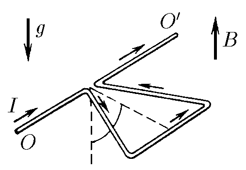

###  Условие 

$9.1.9.$ Треугольная проволочная рамка с током может вращаться вокруг горизонтальной оси $OO^\prime$ , проходящей через вершину треугольника. Масса единицы длины проволоки $\rho$, ток в рамке $I$. Рамка находится в магнитном поле индукции $B$, направленном вдоль поля тяжести. Определите угол отклонения плоскости треугольника от вертикали. 

### Решение

Для решения воспользуемся тем, что $\vec{N} = \vec{M} \times \vec{B}$ справедливо для любого контура $S$ с магнитным моментом $M$ (для доказательства см. [9.1.10](../9.1.10))

Момент сил магнитного поля $$N_{B} = |\vec{M} \times \vec{B}| = ISB \cos\alpha\tag{1}$$ Центр масс будет в точке пересечения медиан, расстояние от этой точки до точки подвеса: $$h_C=\frac{2h}{3}$$ Момент силы тяжести $$M_{mg} = 3a\rho g\cdot \frac{2}{3}h \sin\alpha\tag{2}$$ где $a$ — сторона треугольника, а его площадь $S = \frac{1}{2}ah$ Подставляем полученное в $(2)$ $$M_{mg}= 4S\rho g\cdot \sin\alpha\tag{3}$$ Приравниваем полученные моменты из $(1)$ и $(3)$: $$ISB\cdot \cos\alpha = 4S\rho g \cdot \sin\alpha\Rightarrow \boxed{\tan\alpha = \frac{IB}{4\rho g}}$$ 

#### Ответ

$$\tan\alpha = \frac{IB}{4\rho g}$$ 
