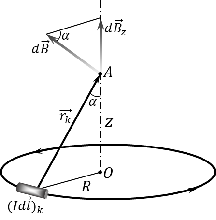

###  Условие

$9.2.10.$ По кольцу радиуса $R$ течет ток $I$. Определите индукцию магнитного поля в центре кольца и на его оси на расстоянии $h$ от центра кольца.

### Решение

Магнитное поле $B$ будет направлено перпендикулярно плоскости кольца. Рассмотрим участок кольца длиной $Rd\theta$ для него будет справедлива формула из [9.2.8](../9.2.8) тогда

$$
dB = \frac{\mu_0 I R}{4\pi (R^2 + h^2)}\cdot d\theta
$$

но так как поле будет направлено вдоль оси, то там нужна его проекция на эту ось

$$
dB\cdot \cos\alpha= \frac{\mu_0 I Rd\theta}{4\pi (R^2 + h^2)} \cdot \frac{R}{\sqrt{R^2 + h^2}}
$$

$$
dB_z = \frac{\mu_0 I R^2d\theta}{4\pi (R^2 + h^2)^{3/2}}
$$

При интегрировании $dB_z$ от $0$ до $2\pi$ получим:

$$
B(h)=\int_0^{2\pi}dB_z=\int_0^{2\pi}\frac{\mu_0 I R^2}{4\pi (R^2 + h^2)^{3/2}}~d\theta
$$

$$
B(h) = \frac{\mu_0 I R^2}{2 (R^2 + h^2)^{3/2}}
$$

подставив $h = 0$ получим известную вам формулу для индуктивности в центре кольца:

$$
B(0) = \frac{\mu_0 I}{2R}
$$

#### Ответ

$$
B=\frac{\mu_0 qv}{4\pi r^2} \sin\alpha; \quad B = \frac{\mu_0 Il}{4\pi r^2}\sin\alpha
$$