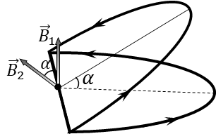

###  Условие 

$9.2.11.$ Во сколько раз уменьшится индукция магнитного поля в центре кольца с током, если его согнуть под углом $\alpha$? Ток в кольце не меняется. 

### Решение

В [9.2.10](../9.2.10) мы получили выражение для магнитной индукции в центре кольца $$B_0 = \frac{\mu_0 I}{2R}\quad(1)$$ В силу суперпозиции, магнитная индукция в центре одного полукольца составит половину от этого значения: $$B_1 = B_2 = \frac{B_0}{2} = \frac{\mu_0 I}{4R}\quad(2)$$ Из чертежа, видно, что угол между векторами $\vec{B}_1$ и $\vec{B}_2$ равен $\alpha$ $$(\vec{B_1},\vec{B_2})=\alpha$$ Суммарный вектор магнитной индукции равен векторной сумме компонент магнитной индукции двух колец $\vec{B}_1$ и $\vec{B}_2$ $$\vec{B} = \vec{B_1} + \vec{B_2} $$ Модуль этого вектора найдем по теореме косинусов $$B = \sqrt{{B_1}^2 + {B_2}^2 - 2B_1 B_2 \cos\alpha} $$ Учитывая выражение $(2)$, суммарную магнитную индукцию найдём как $$B= \frac{\mu_0 I}{4R}\sqrt{2-2\cos\alpha} = \frac{\mu_0 I}{2R}\cdot\sin\frac{\alpha}{2}\quad(3)$$ Разделив выражение $(3)$ на $(1)$, получаем искомое отношение $$\boxed{\frac{B}{B_0} = \sin\frac{\alpha}{2}}$$ 

#### Ответ

$$\frac{B}{B_0} =\sin\frac{\alpha}{2}$$ 
