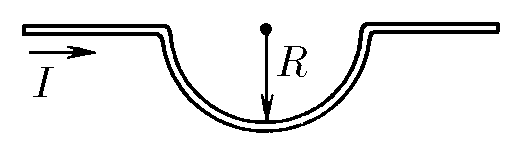

###  Условие 

$9.2.13.$ Длинный прямой провод с током $I$ имеет участок в виде полуокружности радиуса $R$. Определите индукцию магнитного поля в центре полуокружности. 

### Решение

Запишем выражение для индукции участка провода $$d\vec B = \frac{\mu_0 [\vec{(Idx)}\times \vec{R}]}{4\pi R^3}$$ Модуль вектора $d\vec B$ найдём преобразовав векторное произведение $$dB = \frac{\mu_0 Idx}{4\pi R^2}\sin\alpha$$ Где $\alpha$ — угол между радиус-вектором и направление элемента тока. Учитывая, что они совпадают, тогда $\alpha = 0$: $$\sin\alpha = 0\Rightarrow dB = 0$$ Для прямого участка провода, тогда такая конструкция создаёт поле, аналогичное с полем полукольца, которое мы уже считали в [9.2.11](../9.2.11) $$\boxed{B = \frac{\mu_0 I}{4R}}$$ 

#### Ответ

$$B=\frac{\mu_0 I}{4R}$$ 
