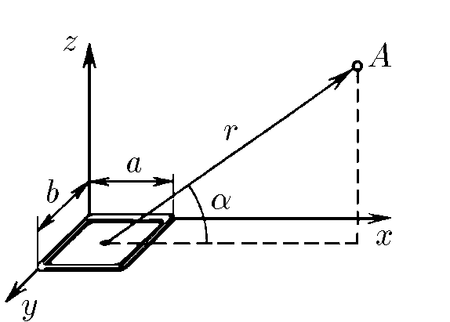

###  Условие

$9.2.17^*.$ Определите индукцию магнитного поля прямоугольной рамки $a \times b$ с током $I$ в точке $A$, находящейся на расстоянии $r$, много большем линейных размеров рамки. Радиус-вектор $\vec{r}$ образует с плоскостью рамки угол $\alpha$

### Решение
Если вам нужно не готовое решение, а хинт, то обратитесь к [листку "Магнитный диполь" на Mathus](https://mathus.ru/phys/mdipole.pdf)

В данной задаче мы имеем дело с магнитным диполем - маленьким замкнутым контуром с током. 

Сначала рассмотрим несколько частных случаев этой задачи.

$1)$ Пусть точка наблюдения $A$ расположена на прямой, проходящей через центр $O$
прямоугольника перпендикулярно его плоскости. 

Заметим, точка $A$ лежит на серединном перпендикуляре к каждой стороне прямоунольника, однако если её чуть-чуть "подвигать" результат почти не изменится.

Магнитный провод длины $l$ создаёт в точке, лежащей на серединном перпендикуляре к этому проводу на расстоянии $h$ от него, магнитное поле равное
$$B=\int dB=\frac{\mu_0 I}{4\pi}\int\frac{dl\cdot r \sin\alpha}{r^3}=\frac{\mu_0 I}{4\pi}\int_{\alpha_0}^{\pi-\alpha_0}\frac{hd\alpha}{\sin^2\alpha}\div\frac{h^2}{\sin^2\alpha}\cdot\sin\alpha$$
$$
B=\frac{\mu_0I}{2\pi h}\cos\alpha_0\tag{1}
$$
и направленное перпендикулярно плоскости $h$ и $l$

Применим эти формулы к проводам длиной $b$. Используем приближение
$$h=\sqrt{\frac{a^2}{4}+r^2}\approx r$$
Пусть $\beta$ - угол между $h$ и проекцией $h$ на плоскость прямоугольника. Тогда
$$\cos\alpha_0=\frac{b}{2r}$$
$$\cos\beta=\frac{a}{2r}$$
Векторно складывая поля, создаваемые 2 проводами длиной $b$ получим суммарное поле
$$B=2B_b\cos\beta=2\frac{\mu_0I}{2\pi r}\cos\alpha_0\cos\beta=\frac{\mu_0Iab}{4\pi r^3}\tag{2}$$
направленное вдоль $\vec r$

Проведя аналогичные рассуждения для второй пары проводков, мы получим точно такой же ответ.
В итоге, для этого частного случая поле равно
$$B_1=2B_b+2B_a=\frac{\mu_0Iab}{2\pi r^3}\tag{3}$$

$2)$ Пусть точка наблюдения $Q$ находится в плоскости контура на продолжении средней
линии прямоугольника.

Заметим, что в этом случае одна из пар проводов лежит практически на на линии $\vec r$, и поэтому (помним про векторное умножение в законе био савара лапласа) практически не вносит вклада в поле в точке наблюдения. 
Провода второй пары (например, длиной $b$) создают в точке наблюдения поля, направленные строго противоположно. Тогда пусть $h\approx r\pm \frac{a}{2}$

$$B_2=B_b1-B_b2=\frac{\mu_0I}{2\pi (r-\frac{a}{2})}\cos\alpha_{01}-\frac{\mu_0I}{2\pi (r+\frac{a}{2})}\cos\alpha_{02}==\frac{\mu_0I}{2\pi r^2}\left({\left({1-\frac{a}{2r}}\right)^{-\frac{1}{2}}-\left({1+\frac{a}{2r}}\right)^{-\frac{1}{2}}}\right)=\frac{\mu_0Iab}{4\pi r^3}$$

Используем приближение $\left({1\pm\frac{a}{2r}}\right)^{-\frac{1}{2}}\approx1\mp\frac{a}{4r}$ и получим:

$$B_2=\frac{\mu_0Iab}{4\pi r^3}$$
Снова отметим, что если немного подвигать точку наблюдения или "покрутить" контур в исходной плоскости ответ практически не изменится, так как такие изменения положения находятся в рамках сделанных приближений.

Для удобства дальнейших выкладок введём вектор магнитного момента диполя, равного $\vec p=I\vec S, \qquad p=Iab$ (Вектор площади витка направлен перпендикулярно его плоскости).
Тогда перепишем в векторной форме полученные ранее выражения:

$$\vec B_1=\frac{\mu_0\vec p}{2\pi r^3}\tag{3}$$
$$\vec B_2=-\frac{\mu_0\vec p}{4\pi r^3}$$

$3)$ Теперь рассмотрим более общий случай, описанный в условии

Представим магнитный момент нашего контура в виде суммы $\vec p=\vec p_1+\vec p_2$, причем пусть $\vec p_1$ направлен параллельно $\vec r$, а  $\vec p_2$ - перпендикулярно.
Физически это можно представить так: поместим на линии наблюдения рядом с контуром токи равные $\pm I$, так, чтобы возникло 2 новых магнитных диполя, перпендикулярных друг другу.
Тогда 
$$
\vec B=\frac{\mu_0\vec p_1}{2\pi r^3}-\frac{\mu_0\vec p_2}{4\pi r^3}=\frac{\mu_0}{4\pi r^3}(2\vec p_1-\vec p_2)=\frac{\mu_0\vec p_1}{4\pi r^3}(3\vec p_1-\vec p)
$$
$\vec p_1\parallel\vec r$, значит $\vec p_1=\frac{ (\vec p\vec r)\vec r}{r^2}$, поэтому в итоге получаем
$$
\vec B=\frac{\mu_0}{4\pi r^3}\left({\frac{ 3(\vec p\cdot\vec r)\vec r}{r^2}-\vec p}\right)
$$
В скалярном виде (угол между $\vec p$ и $\vec r$ равен $\frac{\pi}{2}-\alpha$, значит $\vec p\cdot\vec r=pr\sin\alpha$)
$$
B=\sqrt{\vec B\vec B}=\frac{\mu_0Iab\sqrt{1+3\sin^2\alpha}}{4\pi r^3}
$$

#### Ответ

$$
B=\frac{\mu_0Iab\sqrt{1+3\sin^2\alpha}}{4\pi r^3}
$$