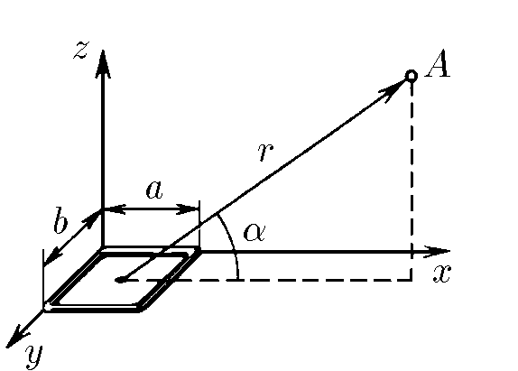

###  Условие

$9.2.17^*.$ Определите индукцию магнитного поля прямоугольной рамки $a \times b$ с током $I$ в точке $A$, находящейся на расстоянии $r$, много большем линейных размеров рамки. Радиус-вектор $\vec{r}$ образует с плоскостью рамки угол $\alpha$

### Решение

Из симметрии следует, что индукция магнитного поля будет присутствовать только в плоскости, заданной углом $\alpha$, т.к. компоненты провода длинны $a$, будут компенсировать друг друга

Распишем косинусы углов, которые составляет $\vec{r}$ с проводами длины $b$ пусть угол $\alpha_1$ будет до ближайшего провода, а угол $\alpha_2$ будет для дальнего, тогда

$$
\cos\alpha_1 = \frac{{2r\cos\alpha} - a}{2r} = \cos\alpha - \frac{a}{2r}
$$

$$
\cos\alpha_2 = \frac{{2r\cos\alpha} + a}{2r} = \cos\alpha + \frac{a}{2r}
$$

**_Теоретическое отступление_**

Магнитный провод длины $l$ создаёт магнитное поле равное

$$
B=\frac{\mu_0I}{2\pi r}\cos\alpha_0
$$

Из геометрии задачи, получаем

$$
\cos\alpha_0 = \frac{b/2}{\sqrt{r^2+b^2/4}} = \frac{b}{2r}\left(1+\frac{b^2}{4r^2}\right)^{1/2}
$$

Используя приближение $(1+x)^\alpha\approx1+\alpha x$, преобразуем до первого порядка малости

$$
\cos\alpha_0 = \frac{b}{2r}\left(1-\frac{b^2}{8r^2}\right)\approx\frac{b}{2r}
$$

Более подробный вывод этой формулы на 76-78 страницах ["Магнитостатика. Электродинамика. Теория колебаний"](http://belpho.org/books/Magnitostatika.pdf) — А.И.Слободянюка Откуда, получаем

$$
\boxed{B_0=B_1=B_2=\frac{\mu_0Ib}{4\pi r^2}}
$$

NO: мы использовали приближение, которое в дальнейшем нам даст ответ с точностью до первого порядка

Из рисунка следует, что полная магнитная индукция магнитного поля $\vec{B}$ будет равняться векторной сумме компонент $\vec{B}_1$ и $\vec{B}_2$

$$
\vec{B}=\vec{B}_1+\vec{B}_2
$$

Тогда модуль вектора можно будет найти по теореме косинусов

$$
B = \sqrt{B_1^2+B_2^2-2B_1B_2\cos\Delta\alpha}
$$

$$
B = B_0\sqrt{2-2\cos\Delta\alpha} = 2B_0\sin\frac{\Delta\alpha}{2}\tag{1}
$$

Учитывая, малость угла $\Delta \alpha$,

$$
\sin\frac{\Delta\alpha}{2} \approx \frac{\Delta\alpha}{2}=\frac{a}{2r}
$$

Подставляем $(1)$:

$$
B = 2B_0\sin\frac{\Delta\alpha}{2} = B_0 \Delta\alpha
$$

Получаем в приближении до первого порядка:

$$
\boxed{B = \frac{\mu_0Ib}{4\pi r^2}\frac{a}{r} = \frac{\mu_0M}{4\pi r^3}}
$$

Если при решении задачи, Вам удалось получить ответ до второго порядка, будьте первым, кто пришлёт решение на [aliaksandr@melnichenka.com](mailto:aliaksandr@melnichenka.com)

#### Ответ

$$
B=\mu_0M\sqrt{1+3\sin^2\alpha} /(4\pi r^3), ~M=Iab
$$