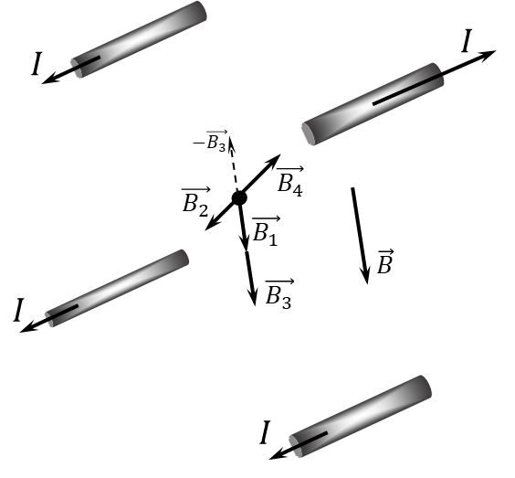

###  Условие

$9.2.5.$ По каждому из четырех длинных прямых параллельных проводников, проходящих через вершины квадрата (стороны квадрата $30 \mathrm{~см}$) перпендикулярно его плоскости, течет ток $10 \mathrm{~А}$, причем по трем проводникам ток течет в одном направлении, а по четвертому — в противоположном. Определите индукцию магнитного поля в центре квадрата.

### Решение

Суммарный вектор магнитной индукции $\vec{B}$, найдём как сумму векторов магнитной индукции, создаваемых каждым из проводов

$$
\vec{B} = \vec{B_1} + \vec{B_2} + \vec{B_3} +\vec{B_4}
$$

Т.к. $\vec{B_2}$ и $\vec{B_4}$ противонаправлены — равны по модулю и противоположны по направлению, то суммарный вектор магнитной индукции $\vec{B}$ будет сонаправлен $\vec{B_1}$ и $\vec{B_3}$ и равен сумме их модулей

$$
\vec{B_2} = -\vec{B_4} \Rightarrow \boxed{B = B_1 + B_3 = 2B_1}\tag{1}
$$

Магнитную индукцию, создаваемую одним проводам на расстоянии $a/\sqrt{2}$ до центра квадрата, найдём как

$$
B_1 = \frac{\mu_0 I}{2\pi\frac{a}{\sqrt{2}}} = \frac{\mu_0 I \sqrt{2}}{2\pi a}
$$

Далее, подставляем полученное выражение для $B_1$ в выражение $(1)$ для суммарной индукции описанной системы

$$
\boxed{B = \frac{\mu_0 I \sqrt{2}}{\pi a} = 18.9\text{ мкТл}}
$$

#### Ответ

$$
B = \frac{\mu_0 I \sqrt{2}}{\pi a} = 18.9\text{ мкТл}
$$