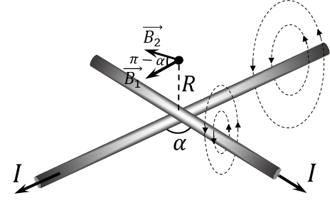

###  Условие 

$9.2.7.$ Длинные прямые провода с током пересекаются под углом $\alpha$. Найдите индукцию магнитного поля на прямой, проходящей через точку пересечения проводов перпендикулярно им обоим. Ток в проводах $I$. 

### Решение

Суммарный вектор магнитной индукции найдём как сумму векторов магнитной индукции, создаваемыми каждыми из векторов $$\vec{B} = \vec{B_1} + \vec{B_2}\tag{1}$$ По правилу правой руки, можно определить направление линий магнитной индукции и заметить, что $\vec{B_1}$ и $\vec{B_2}$ лежат в одной плоскости, параллельной плоскости проводов, под углом $\pi - \alpha$. Тогда, суммарный вектор магнитной индукции $\vec{B}$ из выражения $(1)$, тогда при сложении через теоремы косинусов будет смежный угол — $\alpha$ $$\boxed{B=\sqrt{B_1^2+B_2^2 - 2B_1B_2\cos\alpha}}\tag{2}$$ Магнитную индукцию каждого из них найдём как индукцию бесконечного однорого провода $$B_1 = B_2 = \frac{\mu_0 I}{2\pi R}\tag{3}$$ Подставляем полученное выражение $(3)$ в $(2)$ и получаем искомую индукцию магнитного поля $$B = \frac{\mu_0 I}{2\pi R} \sqrt{2-2\cos\alpha} \Rightarrow \boxed{B = \frac{\mu_0 I}{\pi R}\sin\left(\frac{\alpha}{2}\right)}$$ 

#### Ответ

$$B = \frac{\mu_0 I}{\pi R}\sin\left(\frac{\alpha}{2}\right)$$ 
